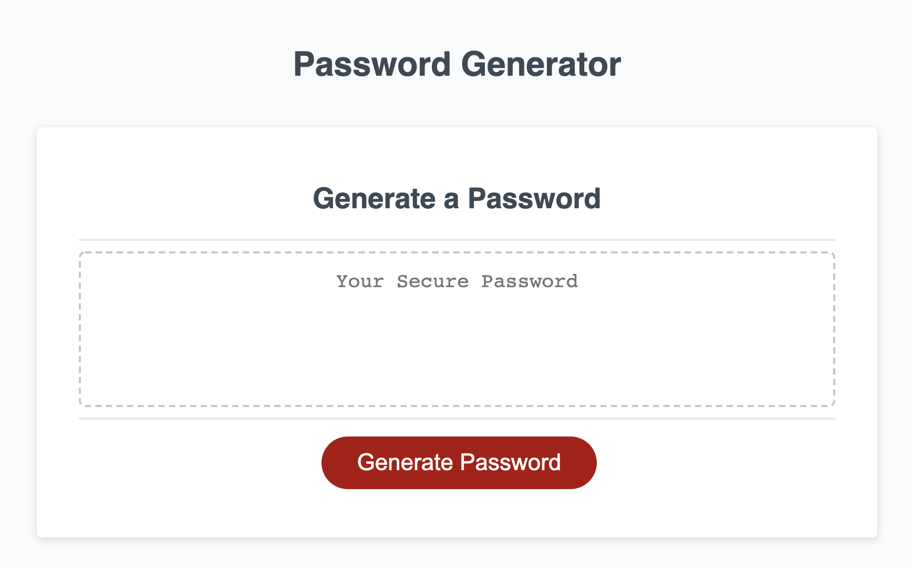

      

## Password Generator Project 

### Table of Contents
1. [About the Project](#About-The-Project)
1. [Project Status](#Project-Status)
1. [Getting Started](#getting-started)

### About the Project

#### This was a password generator project for a DevOps manager at a financial institution. The project scope sought to provide an application which would generate strong, randomly selected passwords providing greater security for sensitive customer data. The application was to have a clean and polished user interface rendering responsively across a variety of devices. 

#### Completion of the acceptance criteria implemented the following items:
#####   - Lorem ipsum
#####   - Lorem ipsum
#####   - Lorem ipsum
#####   - Lorem ipsum

#### The following is a screenshot of the password generator application and overview of its functionality:  

[Project Demo](https://drive.google.com/file/d/1xtw-7ligMoQPSHEXnpOM4gRbLzerBJbW/view?usp=sharing) demonstrates the web application's rendering and functionality on a on a mobile device. 

### Project Status

    
Project Status

    Active

    
Contact

    jendotb@gmail.com

#### Articles and sites which contributed toward the successful completion of this project are included below:

[OWASP](https://owasp.org/www-community/password-special-characters)  
[A Smarter Way To Learn JavaScript](http://www.asmarterwaytolearn.com/)  
[JSHint](https://jshint.com/)  
[How To Style Images With Markdown Blog](https://www.xaprb.com/blog/how-to-style-images-with-markdown/)  
[W3Schools](https://www.w3schools.com/js/default.asp)  

#### Refactor Project Repo & GitHub links:  
[Repo Link](https://github.com/onomatopoetica/password-generator)  
[GitHub Project Link](https://onomatopoetica.github.io/password-generator/)

#### License
##### Distributed under the GNU General Public License v3.0. See `LICENSE` for more information.
